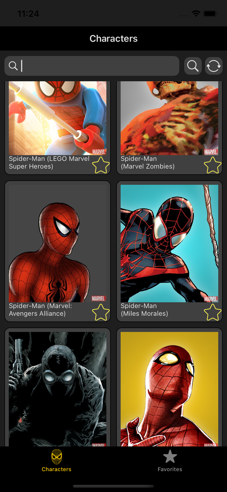
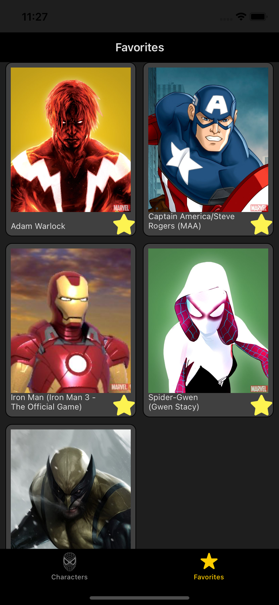
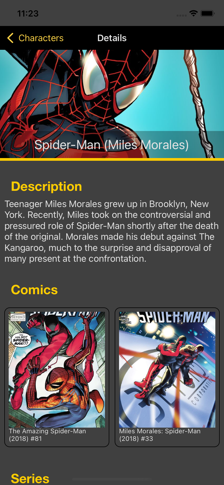

#  DESAFIO PROPOSTO
Nós de mobile somos fãs da Marvel 😍, então por isso gostaríamos de um app para listar os personagens e saber mais sobre eles 🚀.

O objetivo é implementar um app 📱 onde podemos ver a lista de personagens da Marvel. O app deve mostrar uma lista e ser possível navegar para os detalhes de cada personagem 👾. Além disso, deve ser possível favoritar ⭐ os personagens e estes devem ser persistidos no device .
# SCREENSHOTS
Abaixo 👀 temos screenhots das telas do app.

| Lista de Personagens | Lista de Favoritos | Detalhes do Personagem |
|:---:|:---:|:---:|
 |  |  |  |

# CARACTERÍSTICAS DO APLICATIVO
A interface do app 📱 é dividida em 3 partes e deve ser desenvolvida conforme os pontos abaixo.
## Home - Characters
* Listagem dos personagens ordenados por ordem 🔤 alfabética.
 * Botão para favoritar ⭐ personagem nas células.
 * Pull-to-refresh 🔄 para atualizar a lista.
  * Paginação na lista:
    * Carregar 20 personagens 👾 por vez, baixando a próxima página ao chegar no fim da lista.
 * Interface de ⚠️ lista vazia,.
## Favotitos
* Listagem dos personagens favoritados pelo usuário (exibindo apenas o nome e imagem do personagem).
 * Não há limite de personagens a serem favoritados 🤘.
 * Favoritos devem ser persistidos (apenas nome e imagem do personagem) localmente para serem acessados offline.
## Detalhes dos Personagens
 * Foto 🌁 em tamanho maior.
 * Nome do personagem na barra de navegação.
 * Descrição do personagem 👾 se houver, caso contrário exibir uma mensagem "sem descrição." .
 * Lista horizontal de Comics (se houver).
 * Lista horizontal de Series (se houver).
 * Interface de lista vazia.
# TECNOLOGIAS UTILIZADAS
* Swift 5
* Consumo da webApi da `Marvel`
* Persistência local usando o `CoreData`
* Gerenciamento de dependências
    * Alamofire
    * Kingfisher
    * SwiftHash
# DOCUMENTAÇÃO DA API
Para desenvolver o app 📱 você vai precisar usar o endpoint de `"Characters"` da API Marvel. 
Mais informações: https://developer.marvel.com/docs.
# MELHORIAS FUTURAS
* Implementar testes de unidade
* Implementar testes de integração
* Melhorar a qualidade do código
# DIFICULDADES ENCONTRADAS
Pela pouca experiência no desenvolvimento de aplicativos usando `swift` encontrei inúmeras dificuldades. Dentre elas, as mais importantes são:
* Inicialização do App por uma determinada `Xib` (Não inicializar pelo `Storyboard`)
* Acessar o `navigationController` para conseguir exibir a tela de detalhes
* Trabalhar com a assincronissidade das requisições à API
# AGRADECIMENTOS
Gostaria de agradecer aos colegas pelo apoio e pela ajuda durante o desenvolvimento do App. O apoio de vocês foi vital para o término desse projeto 💚 

`#GoMobileRV`